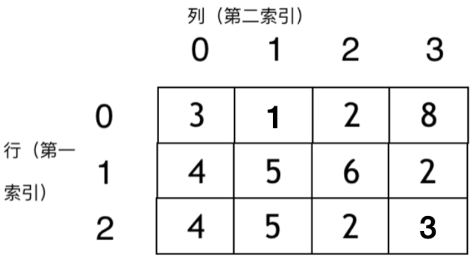
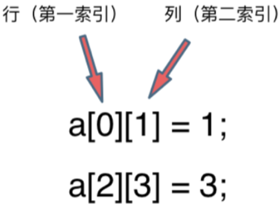

# 数组

## 基础

**列表的定义：一种数据项构成的有限序列，即按照一定的线性顺序，排列而成的数据项的集合。**

**数组的定义：数组是存放在连续内存空间上的相同类型数据的集合，是列表的实现方式之一。**

数组可以方便的通过下标索引的方式获取到下标对应的数据。

下面是一个字符数组的例子：

读取数组中的元素，是通过访问索引的方式来读取的。

二维数组如下图所示：

需要注意的地方：

* 数组下标都是从0开始的。
* 数组内存空间的地址是连续的（C++），在删除或者增添元素的时候，需要移动其他元素的地址。
* 数组的元素是不能删的，只能覆盖。

## 扩展

在C++中，vector的底层实现是array，严格来讲vector是容器，不是数组。

Java是没有指针的，不对程序员暴露其元素的地址，所以应该不是连续的内存地址。
